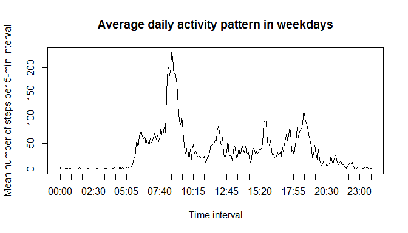

# Reproducible Research: Peer Assessment 1
  

## Loading and preprocessing the data

### 1. Load the data (i.e. read.csv())


```r
setwd("C:/Users/saavedra/Google Drive/FPI-GD/cursos/reproducible research - coursera/assignment/peer assessment 1/repdata_peerassessment1-master")
act <- read.csv("activity/activity.csv")
```

### 2. Process/transform the data (if necessary) into a format suitable for your analysis

Dataset does not need transformation


## What is mean total number of steps taken per day?

### 1. Calculate the total number of steps taken per day


```r
dailystp <- tapply(act$steps, INDEX=act$date, sum, na.rm=T)
dailystp
```

```
## 2012-10-01 2012-10-02 2012-10-03 2012-10-04 2012-10-05 2012-10-06 
##          0        126      11352      12116      13294      15420 
## 2012-10-07 2012-10-08 2012-10-09 2012-10-10 2012-10-11 2012-10-12 
##      11015          0      12811       9900      10304      17382 
## 2012-10-13 2012-10-14 2012-10-15 2012-10-16 2012-10-17 2012-10-18 
##      12426      15098      10139      15084      13452      10056 
## 2012-10-19 2012-10-20 2012-10-21 2012-10-22 2012-10-23 2012-10-24 
##      11829      10395       8821      13460       8918       8355 
## 2012-10-25 2012-10-26 2012-10-27 2012-10-28 2012-10-29 2012-10-30 
##       2492       6778      10119      11458       5018       9819 
## 2012-10-31 2012-11-01 2012-11-02 2012-11-03 2012-11-04 2012-11-05 
##      15414          0      10600      10571          0      10439 
## 2012-11-06 2012-11-07 2012-11-08 2012-11-09 2012-11-10 2012-11-11 
##       8334      12883       3219          0          0      12608 
## 2012-11-12 2012-11-13 2012-11-14 2012-11-15 2012-11-16 2012-11-17 
##      10765       7336          0         41       5441      14339 
## 2012-11-18 2012-11-19 2012-11-20 2012-11-21 2012-11-22 2012-11-23 
##      15110       8841       4472      12787      20427      21194 
## 2012-11-24 2012-11-25 2012-11-26 2012-11-27 2012-11-28 2012-11-29 
##      14478      11834      11162      13646      10183       7047 
## 2012-11-30 
##          0
```

### 2. If you do not understand the difference between a histogram and a barplot, research the difference between them. Make a histogram of the total number of steps taken each day


```r
hist(dailystp, main="Frequency of daily steps", xlab="Daily steps")
```

 

### 3. Calculate and report the mean and median of the total number of steps taken per day


```r
meanstp <- round(mean(dailystp, na.rm=T))
medianstp <- round(median(dailystp, na.rm=T))
```

The mean total number of steps taken per day is 9354

The median total number of steps taken per day is 1.0395\times 10^{4}


## What is the average daily activity pattern?

### 1. Make a time series plot (i.e. type = "l") of the 5-minute interval (x-axis) and the average number of steps taken, averaged across all days (y-axis)


```r
intervstp <- round(tapply(act$steps, INDEX=act$interval, mean, na.rm=T))
plot(intervstp, type="l", xaxt="n", 
     main="Average daily activity pattern",
     ylab="Mean number of steps per 5-min interval", 
     xlab="Time interval")

# Computing axis lab
time <- dimnames(intervstp)[[1]]
for (i in 1:length(time)){
        if (nchar(time[i])==1){time[i] <- paste("000", time[i], sep="")}
        if (nchar(time[i])==2){time[i] <- paste("00", time[i], sep="")}
        if (nchar(time[i])==3){time[i] <- paste("0", time[i], sep="")}
}
hours <- paste(substr(time,1,2), ":", substr(time,3,4), sep="")
# Selecting positions and printing labels
pos <- seq(1,length(hours),length.out=round(length(hours)/10))
axis(1, at=pos, labels=hours[pos])
```

 

### 2. Which 5-minute interval, on average across all the days in the dataset, contains the maximum number of steps?


```r
# Caltulates the position of the max and min limit of the interval with higher mean steps
max.pos <- which (intervstp == max(intervstp))[[1]]
next.pos <- max.pos + 1
min.time <- hours[max.pos]
max.time <- hours[next.pos]
```


The 5-minute interval with the maximum mean number of steps across all the days is the one which corresponds between 08:35 and 08:40.


## Imputing missing values

### 1. Calculate and report the total number of missing values in the dataset (i.e. the total number of rows with NAs)


```r
# Total number of rows with NAs
tot.rows <- nrow(act)
na.rows <- nrow(act[is.na(act),])
```

The total number of registers in the dataset is 17568 of which 2304 contain NAs


### 2. Devise a strategy for filling in all of the missing values in the dataset. The strategy does not need to be sophisticated. For example, you could use the mean/median for that day, or the mean for that 5-minute interval, etc.


```r
# Filling NAs with the average of the steps at this 5-min interval across the study
actNA <- act
for (i in 1:nrow(actNA)){
        if (is.na(actNA[i,"steps"])){
                pos.mean <- match(actNA[i,"interval"], dimnames(intervstp)[[1]])
                actNA[i,"steps"] <- intervstp[pos.mean][[1]]
        }
}
```

### 3. Create a new dataset that is equal to the original dataset but with the missing data filled in.

The dataset is already created and called **actNA**


### 4. Make a histogram of the total number of steps taken each day and Calculate and report the mean and median total number of steps taken per day. Do these values differ from the estimates from the first part of the assignment? What is the impact of imputing missing data on the estimates of the total daily number of steps?


```r
dailystpNA <- tapply(actNA$steps, INDEX=actNA$date, sum)
dailystpNA
```

```
## 2012-10-01 2012-10-02 2012-10-03 2012-10-04 2012-10-05 2012-10-06 
##      10762        126      11352      12116      13294      15420 
## 2012-10-07 2012-10-08 2012-10-09 2012-10-10 2012-10-11 2012-10-12 
##      11015      10762      12811       9900      10304      17382 
## 2012-10-13 2012-10-14 2012-10-15 2012-10-16 2012-10-17 2012-10-18 
##      12426      15098      10139      15084      13452      10056 
## 2012-10-19 2012-10-20 2012-10-21 2012-10-22 2012-10-23 2012-10-24 
##      11829      10395       8821      13460       8918       8355 
## 2012-10-25 2012-10-26 2012-10-27 2012-10-28 2012-10-29 2012-10-30 
##       2492       6778      10119      11458       5018       9819 
## 2012-10-31 2012-11-01 2012-11-02 2012-11-03 2012-11-04 2012-11-05 
##      15414      10762      10600      10571      10762      10439 
## 2012-11-06 2012-11-07 2012-11-08 2012-11-09 2012-11-10 2012-11-11 
##       8334      12883       3219      10762      10762      12608 
## 2012-11-12 2012-11-13 2012-11-14 2012-11-15 2012-11-16 2012-11-17 
##      10765       7336      10762         41       5441      14339 
## 2012-11-18 2012-11-19 2012-11-20 2012-11-21 2012-11-22 2012-11-23 
##      15110       8841       4472      12787      20427      21194 
## 2012-11-24 2012-11-25 2012-11-26 2012-11-27 2012-11-28 2012-11-29 
##      14478      11834      11162      13646      10183       7047 
## 2012-11-30 
##      10762
```


```r
hist(dailystpNA, main="Frequency of daily steps (NA filled)", xlab="Daily steps")
```

 


```r
meanstpNA <- round(mean(dailystpNA, na.rm=T))
medianstpNA <- round(median(dailystpNA, na.rm=T))
```

The mean total number of steps taken per day is 1.0766\times 10^{4}

The median total number of steps taken per day is 1.0762\times 10^{4}


```r
mean.perc <- round((meanstpNA / meanstp) * 100) -100
median.perc <- round((medianstpNA / medianstp) * 100) - 100
```

The impact of filling missing data with the average 5min-interval number of steps is reflected in the mean and median daily number of steps which are incremented in a 15 and a 4 percent respectivelly


## Are there differences in activity patterns between weekdays and weekends?

### 1. Create a new factor variable in the dataset with two levels – “weekday” and “weekend” indicating whether a given date is a weekday or weekend day.


```r
Sys.setlocale("LC_TIME",locale="English")
```

```
## [1] "English_United States.1252"
```

```r
actNA$date <- as.Date(actNA$date)
actNA$day <- weekdays(actNA$date) 
#install.packages("car")
library(car)
actNA$weekday <- recode(actNA$day, 
                    "c('Monday','Tuesday','Wednesday','Thursday','Friday') = 'weekday';
                    c('Saturday','Sunday') = 'weekend'")
```


### 2. Make a panel plot containing a time series plot (i.e. type = "l") of the 5-minute interval (x-axis) and the average number of steps taken, averaged across all weekday days or weekend days (y-axis). See the README file in the GitHub repository to see an example of what this plot should look like using simulated data.


```r
intervstp.days <- round(tapply(actNA$steps, INDEX=list(actNA$weekday, actNA$interval), mean, na.rm=T))
```


```r
plot(intervstp.days[1,], type="l", xaxt="n", 
     main="Average daily activity pattern in weekdays",
     ylab="Mean number of steps per 5-min interval", 
     xlab="Time interval")
axis(1, at=pos, labels=hours[pos])
```

 


```r
plot(intervstp.days[2,], type="l", xaxt="n", 
     main="Average daily activity pattern in weekends",
     ylab="Mean number of steps per 5-min interval", 
     xlab="Time interval")
axis(1, at=pos, labels=hours[pos])
```

 


